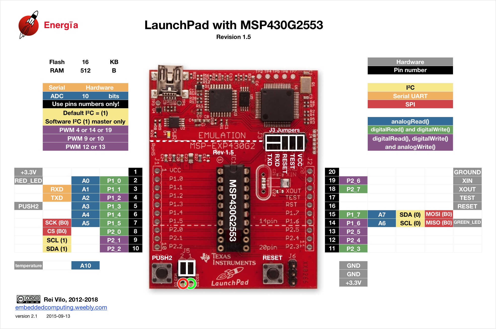
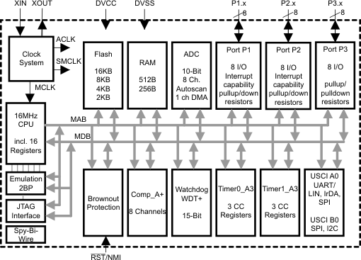
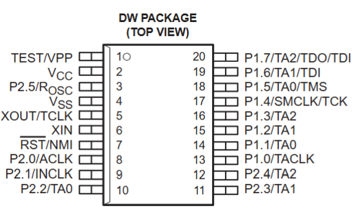
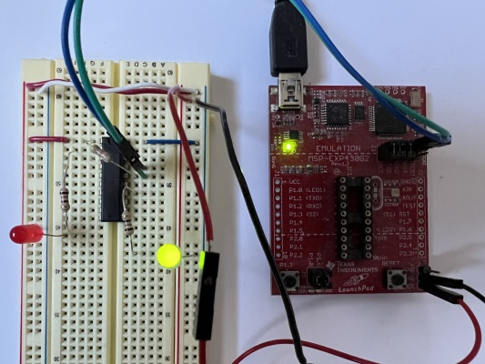
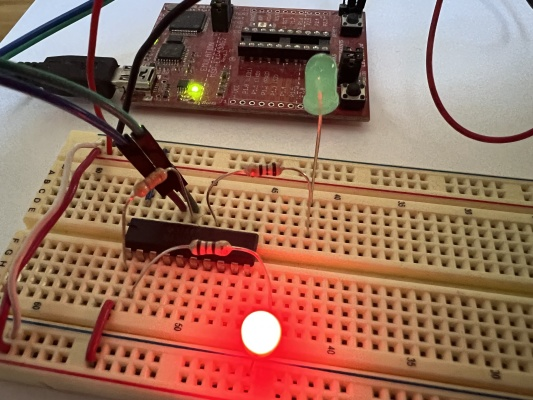

# Arquitetura MSP430G2553

Autor: Weslley Batista 26150629

Professor: Rodrigo Pereira - UFSC Engenharia de Computação

**1. Organização do MSP540G2553**

**Terminais do MSP430**

- CPU (Processador): É o chip físico que faz o processamento (encaixado no socket da placa, que serve apenas como conector). Dentro da CPU ficam a Unidade Lógica e Aritmética (ULA) e os 16 registradores integrados, que são a memória mais rápida do sistema e armazenam dados para a ULA, além de interagir com memórias externas como a RAM.
- Flash: A memória Flash do MSP430 guarda o código em assembly específico do processador desenvolvido pelo humano com o set de instruções (ISA).
- RAM: A memória RAM guarda dados e é relativamente rápida  e próxima ao CPU, mas é volátil e perde os seus dados sem energia.
- Arquitetura Von Neumann: dados e instruções dividem o mesmo espaço de memória e se comunicam com o processador pelos mesmos barramentos físicos.

- **VCC e GND**: Pinos de alimentação. O VCC recebe a tensão positiva e o GND é a terra.
- **Porta 1 (P1.0 a P1.7)**: Pinos de entrada e saída de propósito geral (GPIO). Também podem ser configurados para funções alternativas como entradas para o Conversor Analógico-Digital (ADC), pinos de comunicação serial (UART, SPI, I2C), PWM e interrupções de hardware.
- **Porta 2 (P2.0 a P2.7)**: Pinos de GPIO adicionais, compartilhados com outras funções de timer e captura/comparação. P2.6 e P2.7 geralmente são compartilhados com os pinos XIN e XOUT (para conectar um cristal oscilador externo / clock).
- **RST/NMI**: Pino de reset (reinicia o microcontrolador). Pode ser configurado como uma Interrupção.
- **TEST**: Usado em conjunto com o pino de Reset para habilitar o modo de gravação e depuração.

## 2. Registradores

A CPU do mSP430G2553 usa uma arquitetura [Von Neumann](https://en.wikipedia.org/wiki/TI_MSP430#MSP430_CPU) com um único espaço da memória para os dados e instruções. 

A CPU é integrada com 16 registradores com memória volátil que perde os valores sem energia. Os registradores ficam dentro da CPU e armazenam os dados da Unidade Lógica Aritmética (ULA) manipulados com o set de intruções (ISA) da linguagem Assembly própria do MSP430G2553.

Quatro dos registradores, R0 a R3, são dedicados como contador de programa (program counter), ponteiro de pilha (stack pointer), registrador de status e gerador de constante. Os registradores restantes são registradores de uso geral.

Os periféricos são conectados à CPU usando barramentos de dados, endereço e controle, e podem ser manipulados com o set de instruções.

# Assembly

## 3. O Conjunto de Instruções
A arquitetura do Conjunto de Instruções (ISA) consiste em 51 instruções. Pode processar dados do tipo **word (16 bits)** e **byte (8 bits)** nativamente. As instruções combinam-se a múltiplos modos de endereçamento.

### Tabela: Conjunto de Comandos Assembly
| Instrução | Descrição |
|-----------|-----------|
| `rrc <dst>` | Rotate right through carry. |
| `rra <dst>` | Rotate right arithmetic. |
| `swpb <dst>` | Swap upper / lower bytes. |
| `sxt <dst>` | Sign extend 8 bit value to 16 bit. |
| `push <dst>` | Push value to stack. |
| `call <dst>` | Call a function. |
| `reti` | Return from interrupt. |
| `mov <src>, <dst>` | Copy value from src to dst. |
| `add <src>, <dst>` | dst = dst + src. |
| `addc <src>, <dst>` | dst = dst + src + c. |
| `subc <src>, <dst>` | dst = dst - src. |
| `sub <src>, <dst>` | dst = dst - src + c. |
| `cmp <src>, <dst>` | dst - src (don't store result, but set flags) |
| `dadd <src>, <dst>`| dst = dst + src (BCD mode). |
| `bit <src>, <dst>` | dst & src (don't store result, but set flags) |
| `bic <src>, <dst>` | dst = dst & ~src (clear bits) |
| `bis <src>, <dst>` | dst = dst \| src (set bits) |
| `xor <src>, <dst>` | dst = dst ^ src |
| `and <src>, <dst>` | dst = dst & src |
| `jne / jnz <address>` | Jump if not equal / zero. |
| `jeq / jz <address>` | Jump if equal / zero. |
| `jnc / jlo <address>` | Jump if no carry / lower (unsigned). |
| `jc / jhs <address>` | Jump if carry / higher or same (unsigned). |
| `jn <address>` | Jump if negative flag set. |
| `jge <address>` | Jump if greater than or equal (signed). |
| `jl <address>` | Jump if less (signed). |
| `jmp <address>` | Jump always. |

### Categorias de Operações

**1. Operações de Movimentação de Dados:**
A instrução fundamental é o `MOV`, usada para carregar e transferir dados.
- **Entre registradores**: Ex: `MOV R4, R5` (copia o valor atual contido em R4 e o armazena em R5).
- **Com constantes (Imediato)**: Ex: `MOV #100, R4` (carrega o valor decimal constante 100 no registrador R4). O uso do prefixo `#` diz à CPU que se trata de um valor imediato e não de um endereço.
- **Com a memória**: Ex: `MOV &0x0200, R4` (lê o conteúdo salvo no endereço de memória absoluta 0x0200 e guarda em R4).

**2. Operações Aritméticas:**
Executam cálculos e atualizam as flags de status do processador (como Carry, Zero, Negative, Overflow), usadas para tomar decisões (saltos).
- **Adição simples**: Ex: `ADD R4, R5` soma o conteúdo de R4 ao de R5, guardando o resultado no destino R5 (`R5 = R5 + R4`). Podemos usar constantes também: `ADD #10, R5` (incrementa R5 em 10).
- **Adição com Carry**: Ex: `ADDC R4, R5` faz a soma considerando o bit de transporte (Carry), útil para somar números de 32 bits em uma CPU de 16 bits.
- **Subtração**: Ex: `SUB R4, R5` subtrai a origem do destino (`R5 = R5 - R4`).
- **Comparação**: Ex: `CMP R4, R5` funciona como a subtração, mas descarta o resultado, servindo apenas para atualizar as flags. É geralmente seguida por uma instrução de salto condicional (ex: `JEQ`, `JNE`).

**3. Operações Lógicas (Bit a Bit):**
Manipulam bits isolados (0s e 1s). São a base para ligar/desligar portas e configurar periféricos do microcontrolador.
- **Bit Set (OR lógico)**: Ex: `BIS #0x01, R5` força bits específicos para o nível lógico '1'.
- **Bit Clear (AND NOT)**: Ex: `BIC #0x01, R5` força bits específicos para o nível lógico '0'.
- **Ou Exclusivo (XOR)**: Ex: `XOR #0x01, R5` inverte o estado dos bits específicos ('0' vira '1' e vice-versa).

## 4. Formatos de Instrução
As instruções no MSP430 possuem **três formatos** fundamentais:
1. **Operando Duplo:** Ex: `ADD R4, R5` (Soma R4 com R5 e guarda em R5).
2. **Operando Único:** Ex: `CALL R8` (Chama sub-rotina no endereço R8).
3. **Salto Relativo:** Ex: `JNE` (Jump se não-igual, calculando salto relativo ao PC).

## 5. Modos de Endereçamento
Possui **7 modos para a fonte** e **4 modos para o destino**:
1. **Registrador:** `MOV Rs, Rd`
2. **Indexado:** `MOV X(Rn), Y(Rm)`
3. **Simbólico (PC Relativo):** `MOV EDE, TONI`
4. **Absoluto:** `MOV &MEM, &TCDAT`
5. **Indireto a Registrador:** `MOV @Rn, Y(Rm)`
6. **Indireto com Autoincremento:** `MOV @Rn+, Rm`
7. **Imediato:** `MOV #45, TONI`

### Tabela de Exemplos de Modos de Endereçamento

| Instrução Assembly | Descrição / Explicação |
|--------------------|------------------------|
| `mov.w r8, r9` | (copia o registrador r8 para r9) |
| `mov.w @r8, r9` | (copia 16 bits do endereço apontado por r8 para r9) |
| `mov.w @r8+, r9` | (copia 16 bits do endereço apontado por r8 para r9 r8 = r8 + 2) |
| `mov.b @r8+, r9` | (copia 8 bits do endereço apontado por r8 para r9 r8 = r8 + 1) |
| `mov.w 0x80(r8), r9` | (copia 16 bits do endereço apontado por r8 mais 0x80 para r9. Então, se r8 = 0x200, copia dos endereços 0x280 e 0x281 em little endian) |
| `mov.w &0x200, r9` | (copia 16 bits dos endereços 0x200 / 0x201 em little endian para r9) |
| `mov.b &0x200, r9` | (copia 8 bits do endereço 0x200 para r9 - endereçamento absoluto) |
| `mov.b 0x200, r9` | (copia 8 bits do endereço 0x200 para r9 - endereçamento simbólico) |
| `mov.w r8, &0x200` | (copia 16 bits de r8 para o endereço de memória 0x200 / 0x201 em little endian) |
| `mov.w r8, 0x80(r9)` | (copia 16 bits de r8 para o endereço de memória r9 + 0x80 (e r9 + 0x81) em little endian) |
| `mov.w #5, r9` | (copia o valor 5 para r9) |
| `mov.b #5, r9` | (copia o valor 5 para r9) |

### 6. Arquitetura do MSP430: Modelo de Memória e Linguagem Assembly

A arquitetura do MSP430 é baseada no **Modelo de Von Neumann**. Diferente da arquitetura Harvard (que possui memórias e barramentos separados para dados e instruções), o MSP430 adota uma abordagem de barramento único, a memória de dados e a memória de instrução são juntas.

#### Memória Unificada (Von Neumann)
O microcontrolador possui um único espaço de endereçamento de 16-bits (que vai do endereço `0x0000` até `0xFFFF`). Isso significa que todos os componentes internos compartilham o mesmo "mapa":
*   **Memória Flash:** Onde o código (instruções do programa) é armazenado.
*   **Memória RAM:** Onde ficam as variáveis e dados temporários.
*   **Periféricos:** Os registradores de configuração (Portas I/O, Timers, ADC, etc.)

Como tudo reside no mesmo espaço de endereçamento, a CPU pode usar as mesmas instruções tanto para ler um dado da RAM, quanto para buscar uma instrução na Flash ou acionar um pino no periférico. Não há necessidade de instruções especiais (como o `IN` ou `OUT` de outras arquiteturas) para interagir com o hardware.

#### A Linguagem de Montagem (Assembly) e a Memória
O design unificado da memória reflete diretamente na forma como o Assembly do MSP430 foi projetado. Como a arquitetura nativa é de 16-bits, a CPU transita dados nesse tamanho. No entanto, o set de instruções permite que o programador escolha a forma de endereçamento.

O Assembly distingue as operações através de **sufixos explícitos** nas instruções:
*   **Sufixo `.w` (Word - Palavra de 16-bit):** Manipula 16 bits inteiros de uma só vez (ex: `MOV.w`). Como a CPU é de 16-bits, este costuma ser o comportamento padrão se o sufixo for omitido.
*   **Sufixo `.b` (Byte - 8-bit):** Manipula apenas 8 bits (ex: `MOV.b`). É essencial para alterar registradores de periféricos de 8 bits ou economizar espaço ao trabalhar com tabelas de caracteres, manipulando apenas metade da palavra na memória.